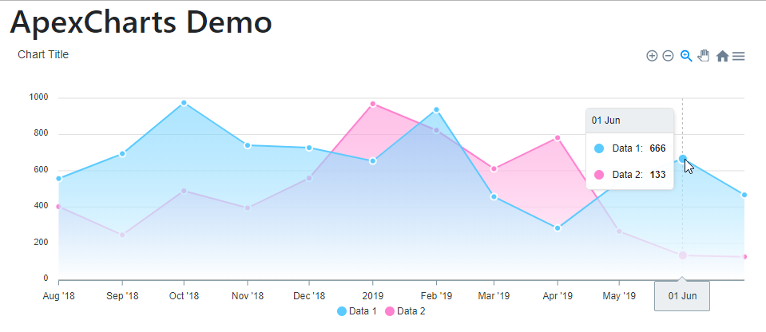

# ApexCharts.NET

C# .Net Standard 2.0 wrapper for the ApexCharts Javascript Library - https://apexcharts.com

 * [Code](Code) - C# .Net Standard 2.0 Library 
 * [Demo](Demo) - Demo Chart App (.Net Core App)
 * [Test](Test) - xUnit Tests (not completed)
 

